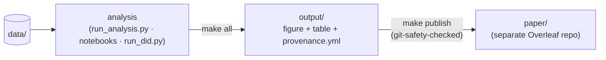

# Reproducible Research Template

[](https://opensource.org/licenses/MIT)
[](https://www.python.org/downloads/)
[](https://julialang.org/)
[](https://www.gnu.org/software/make/)
[](tests/)

**A minimal template for reproducible research in Python, Julia, and Stata — use all three or just one — with provenance tracking and automated builds**

This template provides a complete workflow for building research artifacts (figures and tables) with full provenance tracking, separating build outputs from published results. It ships with Python, Julia, and Stata wired together — Julia runs standalone *or* from within Python (via `juliacall`) — and **one `bootstrap.py` command prunes it to whatever subset you need** (Python is the one constant).



*Every build stamps the git commit and the SHA256 of each input and output; `make publish` is the only sanctioned path from `output/` to `paper/`.*

> **🧩 One, two, or three languages — your choice.** Start with Python + Julia + Stata, then run a single command to drop what you don't need and get a project that still builds cleanly:
> ```bash
> python bootstrap.py --python-only      # just Python
> python bootstrap.py --remove-stata     # Python + Julia
> python bootstrap.py --remove-julia     # Python + Stata
> python bootstrap.py --interactive      # choose interactively
> ```
> Python is always kept (the harness runs on it). Dropping a language also removes the example analyses that need it, so nothing breaks. See [Get started](#-get-started).

---

## 👥 Who Is This For?

This template is designed for:

- **Economists & Social Scientists** conducting empirical research with data analysis
- **Researchers** who need reproducible, traceable research workflows
- **Anyone** who wants to:
  - Track exactly what code produced each figure and table
  - Use one, two, or three languages (Python, Julia, Stata) — pick your stack with one `bootstrap.py` command
  - Separate exploratory analysis from publication-ready outputs
  - Ensure their work can be replicated by reviewers and future researchers
  - Meet journal requirements for replication packages

**Not a fit if:**
- You only need a simple Jupyter notebook (this adds structure for complex projects)
- You don't care about reproducibility or provenance tracking
- You're doing pure software development (not research)

---

## ⚙️ Requirements

- **OS:** Linux or macOS (Windows via WSL 2)
- **RAM:** 8 GB minimum (16 GB recommended)
- **Disk:** ~2.5 GB installed (2 GB Python env + ~0.5 GB Julia); keep ~5 GB free for build cache/outputs
- **Software:** GNU Make 4.3+ (uv & Julia auto-installed) — *or* just Docker
- **Optional:** Nix (reproducible dev shell via `flake.nix`)

---

## 🚀 Get started

This is a **GitHub template**. Click **"Use this template"** at the top of the page to create your **own repo** (its own history), then **set up** the project:

```bash
git clone --recursive https://github.com/<you>/my-project.git   # your repo + the repro-tools submodule
cd my-project
python bootstrap.py --interactive   # choose languages (Python ± Julia ± Stata), rename — see note below
```

Then **build the artifacts** — pick one path (both run from inside `my-project`, so the clone + `cd` above are needed either way):

**Locally** (uv; fastest, best for day-to-day work):
```bash
make environment   # install Python/Julia/(Stata)   (~10–15 min)
make verify        # smoke test (~1 min)
make all           # build every figure + table + provenance → output/
make publish       # copy output/ → paper/ with provenance + git safety checks
```

**In Docker** (isolated; needs only git + Docker — no local Make/uv/Julia). This replaces the `make` steps above:
```bash
docker build -t my-project .
docker run --rm -v "$PWD/output:/project/output" my-project   # runs `make all` in the container → ./output
```

- **Full 5-minute walkthrough:** [QUICKSTART.md](QUICKSTART.md) · **local vs. Docker:** [docs/running_locally_vs_docker.md](docs/running_locally_vs_docker.md)
- **One, two, or three languages?** Python is always included (the harness runs on it); Julia and Stata are optional. Run `bootstrap.py` once, *before* `make environment`, to prune the template to your stack: `--python-only`, or `--remove-julia` / `--remove-stata`, or `--interactive` to choose. It also drops the example analyses that need the removed language (e.g. `julia_demo`, `did_example`), so `make all` still builds cleanly.
- The bundled **example analyses are runnable demos** — keep them to learn the workflow, then remove any with `make remove-analysis NAME=<name>`.
- **Starting your own repo without the button** (clone + reset history): [TEMPLATE_USAGE.md](TEMPLATE_USAGE.md)
- **Cloned without `--recursive`?** `lib/repro-tools/` is empty — run `git submodule update --init --recursive`. Update it later with `make update-submodules` (or `make update-environment` to also reinstall); see [docs/submodule_cheatsheet.md](docs/submodule_cheatsheet.md). Never copy `lib/repro-tools/` by hand — let git manage the submodule.

---

## 🏃 Local vs. Docker: which to use?

Both build paths in **Get started** use the *same* sources (`pyproject.toml` + `uv.lock`, `env/Project.toml`, `Makefile`) — Docker just wraps the same `make environment` / `make all` in a pinned, fully isolated image (best for replication packages, sandboxing untrusted/agent code, and avoiding "works on my machine" drift). Which to pick:

| | Local (native) | Docker |
|---|---|---|
| Setup | `make environment` | `docker build .` |
| Build artifacts | `make all` | `docker run -v "$PWD/output:/project/output" …` |
| Speed | Fast (native) | Slower on macOS (Linux VM) |
| Isolation / OS pinning | Runs on your host | Fully isolated; OS + libs pinned by digest |
| Reproducibility | High (`uv.lock`) | Highest (also pins OS/toolchain) |
| Stata | ✅ if installed | ❌ omitted (commercial license) |
| Prerequisites | GNU Make 4.3+ (uv & Julia auto-installed) | Docker only |
| Best for | Developing & iterating | Replication, sandboxing, CI parity |

**Rule of thumb: develop locally, ship/verify with Docker.** Full guide — prerequisites, how the two relate, why pick one over the other, and caveats — is in **[docs/running_locally_vs_docker.md](docs/running_locally_vs_docker.md)**.

---

## 💻 VS Code Users: No Command Line Required!

**Prefer working in VS Code?** Everything works through the UI:

1. **Install extensions** (VS Code will prompt you)
2. **Press `Ctrl+Shift+P`** → type "task" → browse available tasks
3. **Press `Ctrl+Shift+B`** to build everything
4. **Press `F5`** to debug Python scripts

- **Full guide:** [GETTING_STARTED_VSCODE.md](GETTING_STARTED_VSCODE.md)
- **Cheat sheet:** [.vscode/QUICK_REFERENCE.md](.vscode/QUICK_REFERENCE.md)
- **Details:** [docs/vscode_integration.md](docs/vscode_integration.md)

All Make commands are available as VS Code tasks - you can work entirely in the GUI!

---

## 📊 What This Template Provides

### Core Features

- **Reproducible builds**: GNU Make orchestration with grouped targets
- **Provenance tracking**: Full git state + input/output SHA256 hashes
- **Build/publish separation**: Build in `output/`, publish to `paper/`
- **Multi-language support**: Python, Julia, Stata — keep all three or drop any with `bootstrap.py` (Python is always kept)
- **Julia two ways**: run Julia standalone (`runjulia script.jl`) *or* call it from Python via `juliacall` — both are wired up out of the box (the `julia_demo` notebook calls Julia from Python; `run_did.py` runs its regression in Julia with a Python fallback)
- **Jupyter Notebook support**: Parameterized notebooks via papermill with full provenance
- **VS Code integration**: Complete workflow via GUI (see [docs/vscode_integration.md](docs/vscode_integration.md))
- **Code quality tools**: Integrated linting (ruff), formatting (ruff), and type checking (mypy)
- **Automated testing**: pytest-based test suite for reliability
- **Output comparison**: Diff current vs. published outputs
- **Pre-submission checks**: Comprehensive validation before journal submission
- **Replication reports**: Auto-generated HTML reports for reviewers
- **Example workflows**: Sample scripts for all three languages

### Directory Structure

```
project_template/
├── run_analysis.py    # Unified analysis script (handles all studies)
├── Dockerfile         # Reproducible build image (see "Local vs. Docker")
├── data/              # Input datasets
├── env/               # Environment setup (Python/Julia/Stata)
│   └── examples/      # Sample scripts for testing
├── lib/               # Git submodule: repro-tools (provenance, CLI, publishing utils)
├── notebooks/         # Notebook-based analyses (run via papermill)
├── output/            # Build outputs (can be deleted/rebuilt)
│   ├── figures/       # Generated PDFs
│   ├── tables/        # Generated LaTeX tables
│   ├── provenance/    # Per-artifact build records
│   └── logs/          # Build logs
├── paper/             # Published outputs (separate git repo)
│   ├── figures/       # Published figures
│   ├── tables/        # Published tables
│   └── provenance.yml # Aggregated publication provenance
├── scripts/           # Project helper scripts (e.g. check_prerequisites.sh)
├── tests/             # pytest test suite
└── shared/            # Project configuration
    └── config.py      # Study configurations (STUDIES + DEFAULTS)
```

See `docs/directory_structure.md` for complete details.

---

## 🎯 Workflows

### Building Artifacts

Each analysis script follows a standard pattern:

```bash
make price_base       # Builds one artifact
make all              # Builds all artifacts
```

This produces **three outputs per artifact** (atomically):
- `output/figures/<name>.pdf` - The figure
- `output/tables/<name>.tex` - The table
- `output/provenance/<name>.yml` - Build metadata

### Publishing Results

```bash
make publish                              # Publish all artifacts
make publish PUBLISH_ANALYSES="price_base"  # Publish specific ones
make publish REQUIRE_CURRENT_HEAD=1         # Strict: require current HEAD
```

Publishing enforces **git safety checks**:
- Working tree must be clean
- Branch must not be behind upstream
- Optionally require artifacts from current HEAD

See `docs/publishing.md` for details.

### Provenance Chain

**Build provenance** (`output/provenance/<name>.yml`):
```yaml
artifact: price_base
built_at_utc: '2026-01-17T04:04:49+00:00'
command: [run_analysis.py, price_base]
git:
  commit: cbb163e
  branch: main
  dirty: false
inputs:
  - path: data/housing_panel.csv
    sha256: 48917387...
outputs:
  - path: output/figures/price_base.pdf
    sha256: 3855687d...
```

**Publication provenance** (`paper/provenance.yml`):
- Aggregates all build records
- Tracks when each artifact was published
- Records analysis repo git state at publication time

See `docs/provenance.md` for complete explanation.

### Private maintainer files (optional)

Keep maintainer-only material — working notes, private agent instructions, per-user tool config — out of the public repo while still version-controlling it and using it at its normal paths:

```bash
make private-init     # nested, gitignored `private/` repo + symlinks back into place
```

Nothing here ever ships in the public repo. See [TEMPLATE_USAGE.md](TEMPLATE_USAGE.md) → "Keeping private maintainer files".

---

## 🔧 Adding New Analyses

Adding a new analysis is simple - just add configuration to `config.py`:

1. **Add to config.py STUDIES**:
   ```python
   STUDIES = {
       "price_base": { ... },
       "remodel_base": { ... },
       "my_new_study": {
           "data": DATA_FILES["housing"],
           "xlabel": "Year",
           "ylabel": "My metric",
           "title": "My analysis title",
           "groupby": "region",
           "yvar": "my_variable",
           "xvar": "year",
           "table_agg": "mean",
           "figure": OUTPUT_DIR / "figures" / "my_new_study.pdf",
           "table": OUTPUT_DIR / "tables" / "my_new_study.tex",
       },
   }
   ```

2. **Add to Makefile ANALYSES** and create pattern definition:
   ```makefile
   ANALYSES := price_base remodel_base my_new_study

   # Add pattern definition:
   my_new_study.script  := run_analysis.py
   my_new_study.runner  := $(PYTHON)
   my_new_study.inputs  := $(DATA)
   my_new_study.outputs := $(OUT_FIG_DIR)/my_new_study.pdf $(OUT_TBL_DIR)/my_new_study.tex $(OUT_PROV_DIR)/my_new_study.yml
   my_new_study.args    := my_new_study
   ```

3. **Build and publish**:
   ```bash
   make my_new_study
   make publish PUBLISH_ANALYSES="my_new_study"
   ```

(The inverse — removing an analysis everywhere it's wired in — is `make remove-analysis NAME=<name>`.)

---

## 📦 For Journal Submission

**Authors preparing replication packages:**

```bash
make journal-package    # Creates clean replication package
```

This creates a fresh git repository excluding:
- Development files (`.github/`, `.vscode/`, etc.)
- Author-only directories (`data-construction/`, `notes/`, `paper/`)
- Internal documentation (`TEMPLATE_USAGE.md`, etc.)

See `JOURNAL_EXCLUDE` for complete list and [`docs/journal_editor_readme.md`](docs/journal_editor_readme.md) for journal editor instructions.

---

## 🐍 Python Environment

Managed via uv with automatic Julia integration:

```bash
# Environment wrapper with Julia bridge
env/scripts/runpython script.py

# Direct activation (alternative)
source .venv/bin/activate
python script.py
```

**Packages** (see `pyproject.toml`; exact versions pinned in `uv.lock`):
- pandas, matplotlib, numpy
- pyyaml (for provenance)
- juliacall (Python/Julia interop)
- jinja2 (for pandas LaTeX export)

---

## 📚 Julia Environment

Julia works **two ways** here, and you can use either or both — they share the same repo-local Julia install and `env/Project.toml`:

**Pure Julia** — run a `.jl` script standalone:
```bash
env/scripts/runjulia script.jl
```

**Python/Julia interop** — call Julia from inside a Python script or notebook (via juliacall):
```python
from juliacall import Main as jl
jl.seval("using DataFrames")
df = jl.DataFrame(x=[1,2,3], y=[4,5,6])
```

**Packages** (see `env/Project.toml`):
- PythonCall (Julia/Python interop)
- DataFrames

Julia is auto-installed to `.julia/pyjuliapkg/` via juliacall.

---

## 📊 Stata Environment (Optional)

```bash
env/scripts/runstata script.do
```

**Packages** (see `env/stata-packages.txt`):
- reghdfe, ftools, estout

Installed to `.stata/ado/plus/` (local to project).

---

## 🧪 Examples

Test your setup:

```bash
make examples          # Run all examples
make sample-python     # Python example
make sample-julia      # Pure Julia example
make sample-juliacall  # Python/Julia interop
make sample-stata      # Stata example (if installed)
```

See `env/examples/README.md` for details.

---

## 🔍 Makefile Targets

```bash
make                  # Brief guidance (essential commands)
make help             # Detailed command reference (all targets)
make info             # Comprehensive project information

make environment      # Setup Python/Julia/Stata (one-time)
make update-submodules   # Update the repro-tools submodule (update-environment also reinstalls)
make verify           # Verify environment and data (quick check)
make all              # Build all artifacts
make <artifact>       # Build specific artifact
make remove-analysis NAME=x   # Remove an analysis (config + Makefile block + outputs)

make test-outputs     # Verify all expected outputs exist
make publish          # Publish all to paper/
make publish PUBLISH_ANALYSES="x y"  # Publish specific
make publish REQUIRE_CURRENT_HEAD=1   # Strict: require current HEAD

make test             # Run test suite
make lint             # Run code linter (ruff)
make format           # Auto-format code (ruff)
make type-check       # Run type checker (mypy)
make check            # Run all quality checks (lint + format + type + test)
make diff-outputs     # Compare current vs published outputs
make pre-submit       # Run pre-submission checklist
make replication-report  # Generate replication report
make journal-package  # Create journal submission package
make examples         # Run example scripts
make clean            # Remove all outputs
```

---

## 📖 Documentation

### Quick Start
- [QUICKSTART.md](QUICKSTART.md) - Get up and running in 5 minutes
- [CHANGELOG.md](CHANGELOG.md) - Version history and release notes

### Detailed Guides
- [docs/running_locally_vs_docker.md](docs/running_locally_vs_docker.md) - Local (uv) vs. Docker: how to run each, differences, and when to use which
- [docs/environment.md](docs/environment.md) - Environment setup and management
- [docs/provenance.md](docs/provenance.md) - Provenance tracking system
- [docs/publishing.md](docs/publishing.md) - Publishing workflow and safety checks
- [docs/vscode_integration.md](docs/vscode_integration.md) - Working entirely in VS Code
- [docs/directory_structure.md](docs/directory_structure.md) - Project organization
- [docs/julia_python_integration.md](docs/julia_python_integration.md) - Julia/Python bridge configuration
- [docs/platform_compatibility.md](docs/platform_compatibility.md) - System requirements and GPU support
- [docs/troubleshooting.md](docs/troubleshooting.md) - Common issues and solutions

### For Journal Submission
- [docs/journal_editor_readme.md](docs/journal_editor_readme.md) - One-page quick guide for reviewers
- [docs/paper_output_mapping.md](docs/paper_output_mapping.md) - Map paper figures/tables to outputs
- [docs/expected_outputs.md](docs/expected_outputs.md) - Verification checklist
- [DATA_AVAILABILITY.md](DATA_AVAILABILITY.md) - Data access documentation

### Examples
See [env/examples/](env/examples/) directory for sample scripts in Python, Julia, and Stata.

---

## 🔒 Git Integration

Provenance is tied to git: every build records the commit (and dirty state) it came from. Your project is already a git repo — from **"Use this template"** / `git clone` — so there's nothing extra to set up; just keep your work committed so the records are meaningful:

```bash
make all       # build records embed the current git commit + dirty state
make publish   # records the commit each artifact was published from
```

The `paper/` directory is intended as a **separate git repository** (e.g. an Overleaf remote).

---

## 📞 Troubleshooting

**Quick fixes**:
- Import errors: Use `env/scripts/runpython` not bare `python`
- Build failures: `make clean && make all`
- Environment issues: `make cleanall && make environment`

**Detailed help**: See [docs/troubleshooting.md](docs/troubleshooting.md) for comprehensive solutions.

---

## 🤝 Contributing

We welcome contributions! Whether you're fixing bugs, adding features, or improving documentation:

- **Bug reports**: [Open an issue](https://github.com/rhstanton/project_template/issues/new?template=bug_report.md)
- **Feature requests**: [Open an issue](https://github.com/rhstanton/project_template/issues/new?template=feature_request.md)
- **Pull requests**: See [CONTRIBUTING.md](CONTRIBUTING.md) for guidelines

**Development setup** (contributing to the template itself):
```bash
git clone --recursive https://github.com/rhstanton/project_template.git
cd project_template
make environment
make check  # Run tests, linting, formatting
```

---

## 📄 License

MIT License - See [LICENSE](LICENSE) file.

**Summary**: Free to use, modify, and distribute. Attribution appreciated but not required.

---

## 📚 Citation

If you use this template in your research, please cite:

```bibtex
@software{stanton2026template,
  title = {Reproducible Research Template},
  author = {Stanton, Richard},
  year = {2026},
  url = {https://github.com/rhstanton/project_template}
}
```

See `CITATION.cff` for structured metadata.

---

## 🏷️ Version

**Current version: 2.0.2**

- **Check version**: `env/scripts/runpython run_analysis.py --version` or `make info`
- **Version file**: [`_version.py`](_version.py)
- **Changelog**: [CHANGELOG.md](CHANGELOG.md)

**Dependencies:**
- **repro-tools**: v0.3.3 (git submodule at `lib/repro-tools/`)
  - Provides provenance tracking, CLI utilities, publishing tools
  - See [docs/submodule_cheatsheet.md](docs/submodule_cheatsheet.md) for updates


